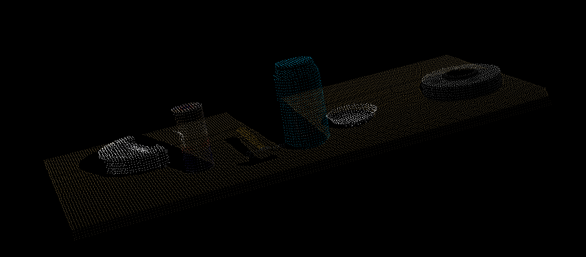
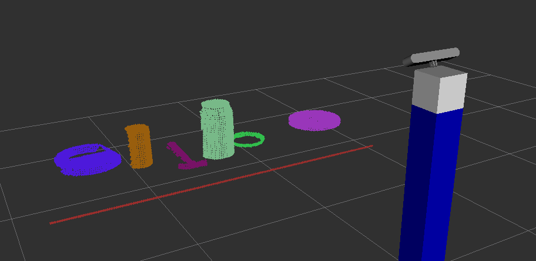
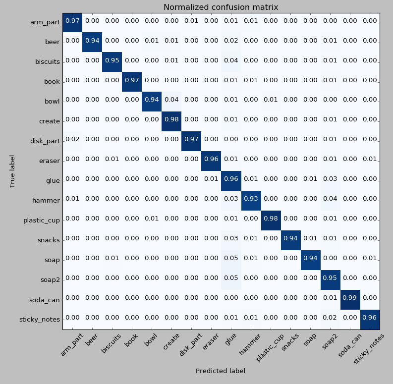
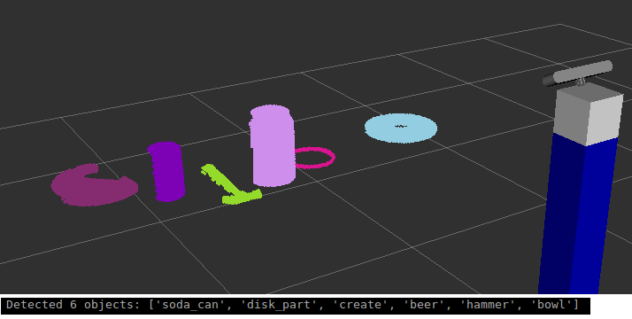
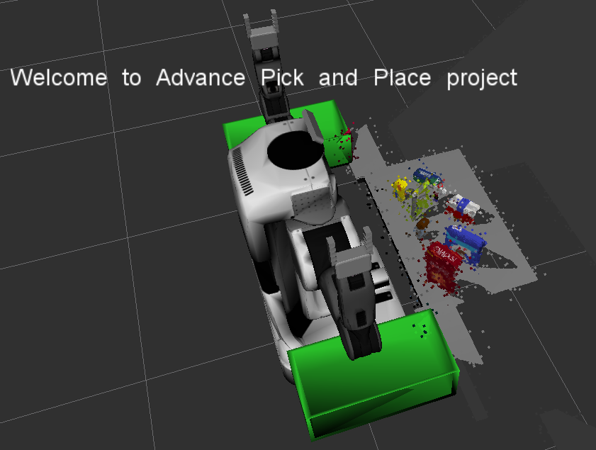
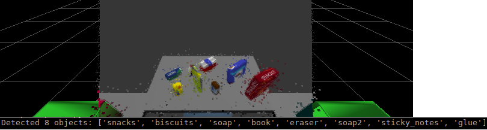

## [Rubric](https://review.udacity.com/#!/rubrics/1067/view)
Here is my writeup for the Udacity RoboND Perception Project.
---
### README
The code for the perception pipeline and training the SVM are located in the "results" folder, along with the output yaml files.

#### 1. Filtering and RANSAC plane fitting

#### 2. Clustering for Segmentation 

#### 3. Object Recognition - Extract features and Trained SVM

#### 4. Pick and Place Demo

# How did I train the SVM?
Instead of only gather features for the objects in the pick and place worlds, I gathered features for all 16 objects.
For each object, I collected features [Color and Normal Histograms] for 200 instances of each object (3200 total).

My goal behind using all the objects was to reduce the misclassification rate. 
Awareness of the other objects allows the SVM model to select more robust support vectors in the feature space.

Then, I trained a linear SVM using 10-K Cross-Fold Validation. The SVM obtained an accuracy of 96%.
The model's speed decreased dramatically and accuracy did not improve when I tried using non-linear kernels - RBF, Poly.

# Implementation Failure
In the third scenario, the perception pipeline occassionally fails to detect the glue object in the scene.
The intermittent detection is caused because the object is partially obscured in the scene.
More robust SVM training that accounts for object occlusion could eliminate this error.

# Future Improvements
I attempted to implement the PR2 Collision Avoidance.
I added the table and other objects to the collision point cloud topic. However, I was unable to add the left and right tables.
I rotated the robot to see the (left/right) tables, but could not retreive a new point cloud inside of the perception pipeline.
I was already inside the callback function for the perception point cloud topic.